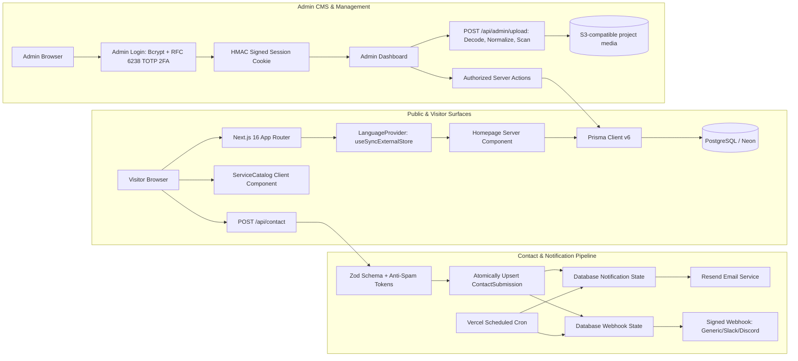

# Nexa Studio Technical Architecture

Current rollout and verification limits are recorded in [PHASE2_STATUS.md](./PHASE2_STATUS.md).

## 1. Architecture overview

Nexa Studio menggunakan Next.js 16 App Router dengan pemisahan boundary yang tegas dan modular:



## 2. Repository boundaries

```text
app/          Presentation, routes, API endpoints, server actions, metadata
components/   Interactive UI components & client islands
lib/          Domain validation, security engines, TOTP, i18n, and infrastructure
prisma/       Schema, migrations, seed, CLI config
public/       Static branding assets
__tests__/    Vitest unit and route-level regression test suites
e2e/          Playwright end-to-end browser & accessibility test suites
Design/       Visual design prototypes (*.png) and markup specifications (code.html)
```

Boundary ini memberikan pemisahan tanggung jawab yang jelas tanpa overhead indirection yang tidak perlu:
- Logika domain & security terletak di `lib/`.
- UI reaktif yang membutuhkan event browser terletak di `components/`.
- Halaman publik editorial tetap Server Components. Pembacaan cookie locale membuat rute publik dirender secara dinamis.

## 3. Rendering and State Model

- **Server Components (RSC)**: `app/page.tsx` membaca proyek dari database. `app/work/[slug]/page.tsx` menyediakan daftar slug melalui `generateStaticParams`, tetapi kontennya tetap dirender dinamis karena locale dibaca dari cookie. Halaman legal juga dinamis untuk memilih bahasa.
- **Client Islands (`'use client'`)**:
  - `components/SiteNav.tsx`: Mengelola mobile drawer, focus trapping, dan selector bahasa.
  - `components/ServiceCatalog.tsx`: Filter kategori dan pencarian instan dengan debounce.
  - `components/ContactForm.tsx`: Form state, pengambilan anti-spam token, idempotensi payload, dan umpan balik kesalahan.
  - `app/start/page.tsx`: Wizard 4 langkah interaktif untuk brief proyek klien.
  - `components/admin/*`: Manajemen proyek, drawer inspeksi lead CRM, dan modal upload gambar.
- **Public Internationalization (i18n)**:
  - Menggunakan React 19 `useSyncExternalStore` pada `lib/i18n/context.tsx`.
  - Mengeliminasi cascading re-renders dan mencegah isu hydration mismatch antara SSR dan client.
  - Menyinkronkan preferensi bahasa lintas tab melalui event `storage` browser; halaman publik dan kontrol CMS tersedia dalam ID/EN. Konten proyek dan lead yang tersimpan tidak diterjemahkan otomatis.
- **Server Actions**: Mutasi data admin dieksekusi melalui Server Actions terotentikasi yang memicu `revalidatePath`.

## 4. Data Model

### `Project`
Menyimpan portfolio publik studio:
- `title`, `type`, `result`: Konten tampilan dan pencapaian metrik.
- `imagePath`, `className`: Presentasi visual (aset katalog, path upload lama, atau `/api/media/{uuid}.webp` dari object storage).
- `order`: Pengurutan terindeks untuk query publik yang stabil.
- `createdAt`, `updatedAt`: Jejak audit operasional.

### `ContactSubmission`
Menyimpan data prospek klien dengan status pengiriman yang dapat diaudit:
- `name`, `email`, `message`: Input terverifikasi Zod.
- `emailSent`: Status pengiriman email notifikasi.
- `idempotencyKey`, `payloadHash`: Mencegah duplikasi submission; konflik `409` terjadi bila key yang sama digunakan dengan payload berbeda.
- `notificationStatus`, `notificationAttempts`, `notificationLeaseUntil`, `notificationNextAttempt`: Lease dan retry email.
- `webhookStatus`, `webhookAttempts`, `webhookLeaseUntil`, `webhookNextAttempt`: Lease dan retry webhook yang independen dari email.
- `createdAt`: Pengurutan submission dan query terindeks.

## 5. Request & Data Pipelines

### Contact Submission & Outbox
```text
Browser JSON
 -> Stream size check (maksimal 32 KB)
 -> JSON parse
 -> Rate limit check (Upstash Redis / bounded local fallback)
 -> Honeypot check & signed HMAC token validation (age > 2s & < 1hr)
 -> Zod validation & SHA-256 payload fingerprinting
 -> Prisma find/create dengan unique idempotencyKey
 -> Database write commit (data dijamin tersimpan)
 -> Respon 200 OK ke browser
 -> Worker cron memproses outbox email dan webhook secara independen
```

### Secure Image Upload Pipeline
```text
Admin FormData
 -> Verifikasi sesi admin HMAC (isAuthenticatedAdmin)
 -> Pembatasan ukuran berkas (maksimal 5 MB)
 -> Verifikasi MIME type whitelist (JPEG, PNG, WebP, AVIF)
 -> Decode penuh dengan batas piksel, normalisasi WebP, penghapusan metadata
 -> Pemindaian ClamAV (wajib di production)
 -> Penamaan aman dengan crypto.randomUUID() dan penyimpanan S3-compatible
 -> Respon URL publik /api/media/{uuid}.webp
```

### Admin Multi-Factor Authentication (TOTP 2FA)
```text
Login Admin Form
 -> Rate limit per IP
 -> Verifikasi password bcrypt terhadap hash ADMIN_PASSWORD
 -> ADMIN_TOTP_SECRET wajib di production
     -> Hitung RFC 6238 HMAC-SHA1 untuk window T-1, T, T+1 (toleransi pergeseran 30 detik)
     -> Verifikasi konstan waktu (crypto.timingSafeEqual)
     -> Klaim time step atomik di PostgreSQL; kode yang dipakai ulang ditolak
 -> Pembuatan sesi cookie bertanda tangan HMAC dengan timestamp
 -> Set cookie HTTP-only, Secure, SameSite=Lax
```

## 6. Security Controls

- **Autentikasi & Sesi**: Cookie sesi bertanda tangan HMAC-SHA256, HTTP-only, SameSite Lax, dan secure di production. Verifikasi menggunakan `crypto.timingSafeEqual`.
- **Multi-Factor Authentication**: RFC 6238 TOTP 2FA untuk login admin, toleransi clock-drift ±1 step, proteksi timing-attack.
- **Proteksi Upload Berkas**: Decode penuh, normalisasi WebP, batas 5 MB dan 24 juta piksel, serta scan ClamAV sebelum menyimpan ke object storage.
- **Anti-Spam & Abuse**: Token bertanda tangan HMAC dengan jendela waktu interaksi minimum (2 detik) dan batas kedaluwarsa (1 jam), disertai perangkap honeypot transparan.
- **Distributed Rate Limiting**: Upstash Redis sliding window dengan fallback memori per proses. Header IP hanya dipercaya dari proxy tepercaya yang dikonfigurasi (`TRUSTED_PROXY_IP_HEADER` atau `x-vercel-forwarded-for`).
- **Idempotensi Transaksional**: Kombinasi UUID idempotency key dan SHA-256 payload hash mencegah duplicate submission maupun race condition pada jaringan tidak stabil.
- **Validasi Input Ketat**: Schema Zod memvalidasi semua payload publik dan admin. Ukuran body dibatasi dari total byte aliran data (`actual bytes`), bukan hanya header `Content-Length`.
- **Aksesibilitas & Keamanan UI**: Axe-core memeriksa aturan otomatis pada halaman terpilih; audit manual dan penilaian WCAG lengkap belum selesai.

## 7. Error & Readiness Model

- **Error Boundaries**: Tersedia global error boundary (`app/error.tsx`) dengan pelacakan ID insiden dan tombol reset, serta branded 404 (`app/not-found.tsx`).
- **Readiness & Liveness Probes**:
  - `/api/health`: Memeriksa kesiapan koneksi database (`SELECT 1`). Mengembalikan `200 OK` atau `503 Service Unavailable` tanpa membocorkan detail internal database.
  - `/api/live`: Memeriksa ketersediaan proses aplikasi Next.js.
  - `/api/cron/notifications`: Memerlukan otorisasi Bearer `CRON_SECRET`.

## 8. Deployment Topology

```text
Vercel / Cloud Edge
  ├── Next.js Application (App Router Server Components & API routes)
  ├── Static Assets (/public/) and S3-compatible project media
  ├── Private ClamAV scanner for production uploads
  ├── Upstash Redis (Distributed Rate Limiting)
  └── Neon PostgreSQL (Serverless Database)
       └── Prisma Schema & Migrations
```

Integrasi pihak ketiga:
- **Resend**: Pengiriman email transaksional terjadwal.
- **External Webhooks**: Outbox bertanda tangan HMAC dengan retry; waktu kirim bergantung jadwal cron dan konfigurasi receiver.

## 9. Environment Contract

| Variable | Scope | Required? | Purpose |
| :--- | :--- | :---: | :--- |
| `DATABASE_URL` | Server | **Yes** | Koneksi PostgreSQL runtime dan Prisma CLI |
| `ADMIN_PASSWORD` | Server | **Yes** | Hash bcrypt password admin owner |
| `ADMIN_SESSION_SECRET` | Server | **Yes** | Secret acak penandatangan cookie sesi & token anti-spam |
| `ADMIN_TOTP_SECRET` | Server | **Production required** | Secret RFC 6238 untuk owner admin |
| `NOTIFICATION_WEBHOOK_URL`, `NOTIFICATION_WEBHOOK_SECRET`, `NOTIFICATION_WEBHOOK_KIND` | Server | Optional pair | Endpoint, secret tanda tangan, dan format payload |
| `PROJECT_MEDIA_BUCKET`, `PROJECT_MEDIA_REGION`, `PROJECT_MEDIA_ENDPOINT` | Server | Upload required | S3-compatible object storage |
| `CLAMAV_SOCKET_PATH` or `CLAMAV_HOST` | Server | Production uploads required | Pemindai berkas pada jaringan privat |
| `RESEND_API_KEY` | Server | Optional | API key Resend untuk notifikasi email |
| `CONTACT_EMAIL_TO` | Server | Optional | Alamat email tujuan penerima notifikasi lead |
| `RESEND_FROM_EMAIL` | Server | Optional | Identitas pengirim email terverifikasi |
| `CRON_SECRET` | Server | Optional | Bearer secret otorisasi endpoint cron outbox |
| `UPSTASH_REDIS_REST_URL` | Server | Optional | REST URL Upstash Redis untuk rate limiter terdistribusi |
| `UPSTASH_REDIS_REST_TOKEN`| Server | Optional | Token Upstash Redis |
| `TRUSTED_PROXY_IP_HEADER` | Server | Optional | Header IP reverse proxy (kosongkan di Vercel) |
| `NEXT_PUBLIC_SITE_URL` | Public | Optional | URL kanonikal untuk metadata Open Graph dan sitemap |
| `NEXT_PUBLIC_WHATSAPP_NUMBER` | Public | Optional | Nomor kontak WhatsApp untuk konsultasi |

## 10. Verification Gates

```bash
# 1. Static code analysis & linting
npm run lint

# 2. TypeScript compilation check
npx tsc --noEmit

# 3. Unit & integration test suites
npm test

# 4. Production Turbopack build
npm run build

# 5. Automated WCAG accessibility audit
npx playwright test e2e/accessibility.spec.ts

# 6. End-to-end browser test suites
npx playwright test
```
