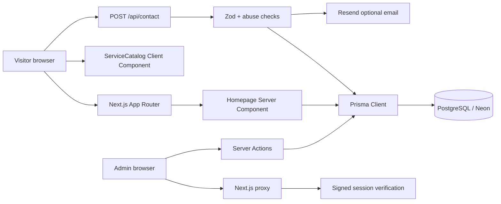

# Nexa Studio Technical Architecture

## 1. Architecture overview

Nexa Studio menggunakan Next.js App Router dengan boundary sederhana:



## 2. Repository boundaries

```text
app/          presentation, routes, server actions, metadata
components/   interactive UI components
lib/          infrastructure and reusable domain validation
prisma/       schema, migration, seed, CLI config
public/       static assets
__tests__/    unit and route-level regression tests
```

Project belum dipecah menjadi banyak feature package. Scope saat ini cukup kecil
sehingga `app`, `components`, `lib`, dan `prisma` memberikan boundary yang jelas
tanpa indirection yang tidak perlu.

## 3. Rendering model

- `app/page.tsx` adalah dynamic Server Component karena membaca project terurut
  dari Prisma.
- `components/ServiceCatalog.tsx` adalah Client Component karena state
  search/filter harus berubah tanpa server round trip.
- `components/ContactForm.tsx` adalah Client Component karena memiliki form
  state, timeout, validation feedback, dan submission lifecycle.
- Admin mutation menggunakan Server Actions dan revalidate path terkait.
- Root metadata dan JSON-LD didefinisikan di `app/layout.tsx`.

## 4. Data model

### `Project`

Menyimpan portfolio publik:

- `title`, `type`, `result` — display content.
- `imagePath`, `className` — visual presentation.
- `order` — stable public sorting dan indexed query.
- `createdAt`, `updatedAt` — operational timestamps.

### `ContactSubmission`

Menyimpan lead brief:

- `name`, `email`, `message` — validated user input.
- `emailSent` — hasil delivery Resend optional.
- `createdAt` — submission ordering dan indexed query.

Tidak ada payment atau client-account entity pada scope produk sekarang.

## 5. Request flows

### Contact submission

```text
Browser JSON
 -> ArrayBuffer size check (32 KB)
 -> JSON parse
 -> rate limit
 -> honeypot/render-time checks
 -> Zod validation
 -> Prisma create
 -> optional Resend notification
 -> safe JSON response
```

Database write dipertahankan walaupun optional email delivery gagal agar lead
tidak hilang secara diam-diam.

### Admin authorization

```text
Request /admin
 -> proxy membaca signed cookie
 -> invalid/missing session redirect login
 -> page/action menjalankan authorization guard sendiri
 -> authorized operation mencapai Prisma
```

Proxy adalah routing guard optimistis, bukan satu-satunya security boundary.

## 6. Security controls

- Production membutuhkan `ADMIN_SESSION_SECRET`.
- Production membutuhkan `ADMIN_PASSWORD` berformat bcrypt.
- Session cookie HTTP-only, SameSite Lax, dan secure di production.
- HMAC-SHA256 menandatangani timestamped session token.
- Login dan contact request menggunakan bounded in-memory rate limiting.
- Contact body size dicek dari actual bytes, bukan hanya `Content-Length`.
- Project image path menolak external/protocol-relative path.
- Zod memvalidasi public dan admin mutation payload.
- Internal error dilog server-side tetapi tidak dikembalikan ke client.

### Known scale limitation

Rate limiter saat ini process-local. Deployment multi-instance atau serverless
harus menggantinya dengan provider distributed seperti Redis/Upstash dan
mendefinisikan failure behavior sebelum production rollout.

## 7. Error and readiness model

- Loading boundaries tersedia global dan admin.
- Error boundaries tersedia global dan admin.
- Contact API mengembalikan `400` untuk malformed/invalid input, `413` untuk
  oversized body, `429` untuk rate limit, dan `500` untuk unexpected failure.
- `/api/health` mengembalikan `200` saat `SELECT 1` berhasil dan `503` saat
  database tidak tersedia.

## 8. Deployment topology

```text
Vercel
  ├── Next.js application
  ├── Environment variables
  └── Neon PostgreSQL
       └── Prisma migrations via deploy step
```

Resend adalah external notification dependency. Static asset dilayani aplikasi
Next.js dan dioptimalkan melalui `next/image`.

## 9. Environment contract

| Variable | Scope | Purpose |
| --- | --- | --- |
| `DATABASE_URL` | Server | PostgreSQL connection |
| `RESEND_API_KEY` | Server | Optional email notification |
| `CONTACT_EMAIL_TO` | Server | Notification destination |
| `RESEND_FROM_EMAIL` | Server | Sender identity |
| `ADMIN_PASSWORD` | Server | Bcrypt admin credential |
| `ADMIN_SESSION_SECRET` | Server | Session signing secret |
| `NEXT_PUBLIC_WHATSAPP_NUMBER` | Public | WhatsApp CTA destination |
| `NEXT_PUBLIC_CONTACT_EMAIL` | Public | Footer contact |
| `NEXT_PUBLIC_SITE_URL` | Public/build | Canonical URL and metadata |

Jangan expose server-only secrets melalui `NEXT_PUBLIC_*`.

## 10. Verification gates

```bash
npm test
npx tsc --noEmit
npm run lint
npm run build
node --env-file=.env.local ./node_modules/prisma/build/index.js validate
node --env-file=.env.local ./node_modules/prisma/build/index.js migrate status
git diff --check
```

Sebelum deployment, smoke-test `/`, `/api/health`, redirect `/admin`, contact
validation, dan responsive widths dari 320px sampai 1440px.

## 11. Evolution guidelines

1. Extract service definitions ke domain/data module jika menjadi CMS-managed.
2. Introduce lead status model sebelum CRM workflow.
3. Add real identity provider sebelum client accounts.
4. Add distributed rate limiting sebelum horizontal scaling.
5. Add browser E2E tests sebelum mengubah conversion-critical flow.
