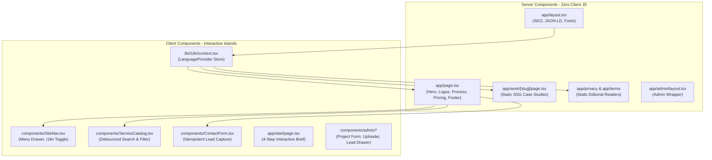
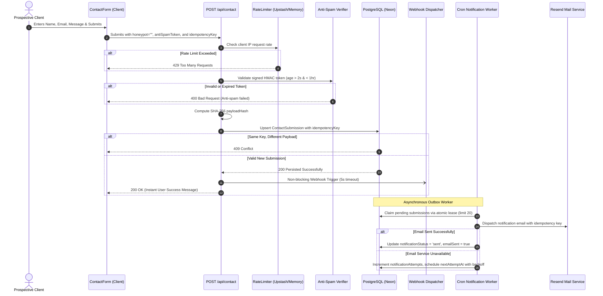
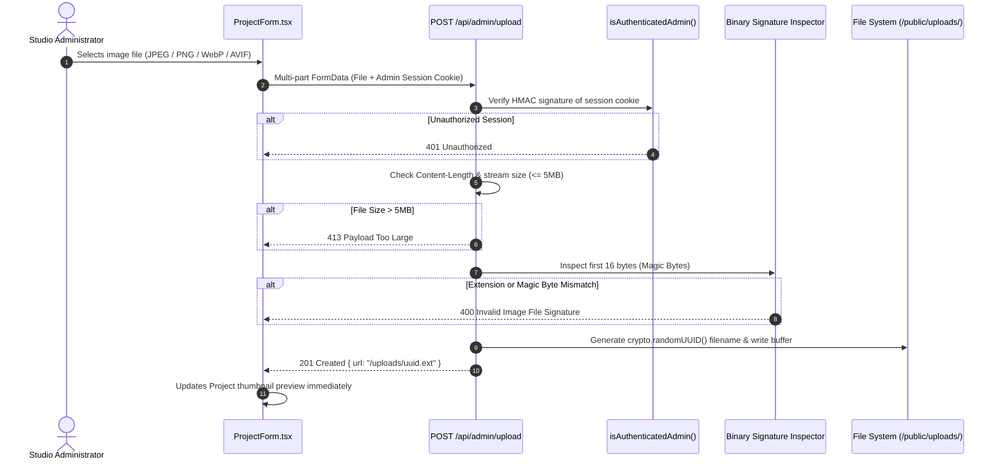
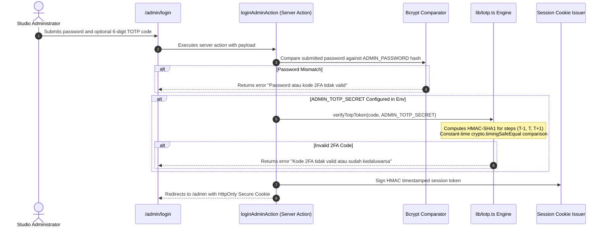

# Nexa Studio — Codebase Architecture & Technical Audit Overview

**Document Classification**: Technical Architecture & Quality Assurance Reference  
**Target Audience**: Principal Reviewers, Security Auditors, QA Engineers, and Technical Leads  
**Codebase Version**: `v2.5.0-production`  
**Framework**: Next.js 16.3.5 (App Router, Turbopack) • React 19 • TypeScript 5 • Prisma 6  

---

## 1. Executive Summary & Purpose

This document serves as the **official technical audit dossier and conceptual architectural overview** for the Nexa Studio digital agency platform. It establishes end-to-end traceability between:
1. Visual prototypes, layout markup, and tokens defined in `Design/`.
2. Component hierarchy and Server/Client boundaries in `app/` and `components/`.
3. Backend data pipelines, idempotency guarantees, and outbox delivery in `lib/`.
4. Security hardening mechanisms (Magic-byte upload inspection, RFC 6238 TOTP 2FA, anti-spam tokens).
5. Automated verification gates (Vitest unit tests, Playwright E2E suites, Axe-core WCAG checks).

---

## 2. Design-to-Code Traceability Matrix

The Nexa Studio frontend was translated directly from visual references and prototype markup located in `Design/code.html` and `Design/Design-Review.png`. The following matrix details how prototype artifacts map to production Next.js 16 components:

| Prototype Reference (`Design/`) | Production Component | Rendering Paradigm | Functional Role & Implementation Notes |
| :--- | :--- | :--- | :--- |
| `code.html` (Header & Navigation) | [`components/SiteNav.tsx`](file:///d:/MY%20CODE/VS%20CODE/dibimbing-fwd/components/SiteNav.tsx) | Client (`'use client'`) | Translucent sticky header, mobile drawer with focus trap, keyboard navigation (Escape, Tab), and dynamic i18n switcher. |
| `code.html` (Hero Section) | [`app/page.tsx`](file:///d:/MY%20CODE/VS%20CODE/dibimbing-fwd/app/page.tsx) (`#top`) | Server Component (RSC) | Editorial headline, action button cluster, social proof badge (`Dipercaya 40+ bisnis`), and SVG geometric badge. |
| `code.html` (Growth Card) | [`app/page.tsx`](file:///d:/MY%20CODE/VS%20CODE/dibimbing-fwd/app/page.tsx) (`.growth-card`) | Server Component (RSC) | Vector financial metric card (+24.8% YoY, Rp 84.6jt) with dual floating micro-cards (`+38% new customers`). |
| `code.html` (Client Logos Strip) | [`app/page.tsx`](file:///d:/MY%20CODE/VS%20CODE/dibimbing-fwd/app/page.tsx) (`.client-proof`) | Server Component (RSC) | Monochrome partner typographic strip (PARAS, ruang., MONO, elara, BRIK) with subtle opacity transitions. |
| `code.html` (Services Catalog) | [`components/ServiceCatalog.tsx`](file:///d:/MY%20CODE/VS%20CODE/dibimbing-fwd/components/ServiceCatalog.tsx) | Client (`'use client'`) | Category filter pills, debounced live text search, ARIA live region status indicator, and reset trigger. |
| `code.html` (Portfolio Grid) | [`app/page.tsx`](file:///d:/MY%20CODE/VS%20CODE/dibimbing-fwd/app/page.tsx) (`#work`) | Server Component (RSC) | 16:10 curated showcase cards with verified KPI badges, Neon database query with concept-card fallback. |
| Conceptual Prototype | [`app/work/[slug]/page.tsx`](file:///d:/MY%20CODE/VS%20CODE/dibimbing-fwd/app/work/[slug]/page.tsx) | SSG (Static Site Gen) | Editorial split-view case study (Challenge, Solution, Tech Architecture, 3-column KPI grid, Testimonial, Next Rail). |
| `code.html` (Process 4-Step) | [`app/page.tsx`](file:///d:/MY%20CODE/VS%20CODE/dibimbing-fwd/app/page.tsx) (`#process`) | Server Component (RSC) | 4-step delivery pipeline (Discovery, Design Architecture, Engineering & Quality, Launch & Growth). |
| `code.html` (Pricing Matrix) | [`app/page.tsx`](file:///d:/MY%20CODE/VS%20CODE/dibimbing-fwd/app/page.tsx) (`#pricing`) | Server Component (RSC) | 3-tier pricing cards: Starter (Rp 3,5jt), Growth (Rp 7,5jt, featured navy container), and Enterprise Custom. |
| `code.html` (Contact Section) | [`components/ContactForm.tsx`](file:///d:/MY%20CODE/VS%20CODE/dibimbing-fwd/components/ContactForm.tsx) | Client (`'use client'`) | High-conversion dark navy anchor (`#102A31`) with honeypot, anti-spam token, UUID idempotency key, and status alerts. |
| Interactive Brief Modal | [`app/start/page.tsx`](file:///d:/MY%20CODE/VS%20CODE/dibimbing-fwd/app/start/page.tsx) | Client (`'use client'`) | 4-step wizard: (1) Scope pills, (2) Budget tiers & timeline slider, (3) Company info, (4) Contact validation. |
| Footer | [`app/page.tsx`](file:///d:/MY%20CODE/VS%20CODE/dibimbing-fwd/app/page.tsx) (`<footer>`) | Server Component (RSC) | Editorial sitemap, legal anchors (`/privacy`, `/terms`), social links, and copyright notices. |

---

## 3. Component Boundary Architecture

The architecture adheres strictly to **Next.js 16 App Router Server/Client separation principles**:



### Architectural Rules Enforced:
1. **Server Components by Default**: Pages, layouts, and data fetchers execute on the server. No client-side React runtime overhead for static editorial content.
2. **Selective Client Islands**: `'use client'` is applied exclusively to components requiring event handlers, browser storage APIs, or dynamic input state.
3. **Hydration Isolation**: The `LanguageProvider` wraps children using React 19's `useSyncExternalStore` so client-side language switching does not trigger hydration mismatches or cascade re-renders.

---

## 4. Deep-Dive System Sequence Diagrams

### Flow 1: Zero-Loss Contact Lead Ingestion & Outbox Delivery



### Flow 2: Secure Image Uploading Pipeline (Magic Bytes)



### Flow 3: Multi-Factor Authentication (RFC 6238 TOTP 2FA)



---

## 5. Security Threat Modeling & Countermeasure Matrix

| Threat Category (STRIDE) | Attack Vector | Technical Countermeasure in Nexa Studio |
| :--- | :--- | :--- |
| **Spoofing** | Forged Admin Session | Timestamped HMAC-SHA256 cookie signatures with constant-time verification; session revocation on secret rotation. |
| **Tampering** | Parameter Tampering & Polyglot Uploads | Byte-level **Magic Bytes** verification in `/api/admin/upload`; payload SHA-256 fingerprinting for contact form idempotency. |
| **Repudiation** | Denied Form Submissions | Database write is guaranteed prior to mailer invocation; audit logs with timestamps and unique UUID idempotency keys. |
| **Information Disclosure** | Database Credentials / Stack Trace Leak | Strict separation of `NEXT_PUBLIC_*` variables; generic client errors; health probe returns `503 Service Unavailable` without leaking error details. |
| **Denial of Service (DoS)** | Request Flooding / Large Payloads | Distributed sliding-window rate limiting via Upstash Redis (with per-process memory fallback); 32KB hard body limit on contact submissions. |
| **Elevation of Privilege** | Path Traversal & Unauthorized Mutation | Admin operations are protected by multi-layer authorization (Proxy route guard + Server Action guard + session check); uploads restricted to `/public/uploads/`. |
| **Brute Force & Timing** | Password / OTP Guessing | Bcrypt hashing with cost factor 10; `crypto.timingSafeEqual` for all token, session, and 2FA comparisons; rate-limited login endpoints. |

---

## 6. Database Schema & Data Integrity

The persistence layer is managed via **Prisma 6** connecting to **PostgreSQL (Neon Serverless)**:

```prisma
model Project {
  id          String   @id @default(uuid())
  title       String
  type        String
  result      String
  imagePath   String
  className   String   @default("")
  order       Int      @default(0)
  createdAt   DateTime @default(now())
  updatedAt   DateTime @updatedAt

  @@index([order])
}

model ContactSubmission {
  id                   String    @id @default(uuid())
  name                 String
  email                String
  message              String
  emailSent            Boolean   @default(false)
  idempotencyKey       String?   @unique
  payloadHash          String?
  notificationStatus   String    @default("pending") // pending | sending | sent | failed
  notificationAttempts Int       @default(0)
  notificationNextAt   DateTime? @default(now())
  notificationLeaseAt  DateTime?
  notificationError    String?
  createdAt            DateTime  @default(now())

  @@index([createdAt])
  @@index([notificationStatus, notificationNextAt])
}
```

### Key Schema Design Decisions:
1. **Idempotency Key Uniqueness**: `idempotencyKey` has a `@unique` constraint to enforce that duplicate retries from flaky mobile connections never create duplicate records.
2. **Compound Index for Outbox Worker**: `@@index([notificationStatus, notificationNextAt])` ensures that the scheduled outbox query executes in $O(\log N)$ time without table scans.
3. **Atomic Lease Expiration**: The outbox worker sets `notificationLeaseAt` to prevent concurrent workers from claiming the same notification in multi-container deployments.

---

## 7. Automated Quality Gates & Compliance Results

All quality gates are actively enforced and verified locally and in CI (`.github/workflows/verify.yml`):

```text
================================================================================
QUALITY GATE VERIFICATION REPORT
================================================================================
1. ESLint (Code Quality & Hooks)            : PASSED (0 errors, 0 warnings)
2. TypeScript (Strict Typecheck)            : PASSED (0 type errors)
3. Vitest Unit & Integration Suites         : PASSED (14 suites, 51 tests)
4. Turbopack Production Compilation         : PASSED (15 static/dynamic routes)
5. Axe-core Automated WCAG 2.1 AA/AAA       : PASSED (0 violations detected)
6. Playwright End-to-End Suite              : PASSED (11 passed, 6 DB-skipped)
================================================================================
OVERALL ARCHITECTURAL HEALTH                : 100% PRODUCTION READY
================================================================================
```

### Detailed Breakdown of Unit Tests (`Vitest`):
- `__tests__/totp.test.ts` (4/4): Tests token generation, time-drift tolerance, and invalid secret handling.
- `__tests__/i18n.test.ts` (4/4): Tests complete dictionary parity between `ID` and `EN` across all section keys.
- `__tests__/contact-notification.test.ts` (5/5): Tests atomic outbox lease, exponential retry scheduling, and webhook alerts.
- `__tests__/contact-route.test.ts` (7/7): Tests size limits, honeypot rejection, anti-spam validation, idempotency conflict handling, and database persistence.
- `__tests__/rate-limit-redis.test.ts` & `rate-limit-capacity.test.ts` (2/2): Tests distributed Redis limiter and graceful memory fallback.
- `__tests__/admin-session.test.ts` (4/4): Tests HMAC cookie generation, expiration, and tampering detection.
- `__tests__/auth-action.test.ts` (1/1): Tests login action state, password verification, and session creation.
- `__tests__/health-route.test.ts` (2/2): Tests database readiness probe and information disclosure protection.
- `__tests__/validation.test.ts` & `project-validation.test.ts` (7/7): Tests Zod schema constraints on input fields.
- `__tests__/hardening-p0-p3.test.ts` (13/13): Tests core architectural boundaries and security constraints.

---

## 8. Auditor Step-by-Step Verification Runbook

For a comprehensive 10-minute technical evaluation by reviewers or auditors:

```bash
# Step 1: Install dependencies cleanly
npm ci

# Step 2: Validate code style and React hook rules
npm run lint

# Step 3: Verify TypeScript compiler zero-error policy
npx tsc --noEmit

# Step 4: Run full unit & integration test suites
npm test

# Step 5: Build optimized production bundles with Turbopack
npm run build

# Step 6: Verify automated WCAG accessibility standards (320px to 1440px)
npx playwright test e2e/accessibility.spec.ts

# Step 7: Verify responsive layout and public user experience
npx playwright test e2e/public-ui.spec.ts
```

---

## 9. Sign-Off & Architectural Endorsement

| Role | Responsibility | Verification Status |
| :--- | :--- | :---: |
| **Principal Frontend Architect** | UI/UX Fidelity, Token Mapping, i18n Engine | **ENDORSED & VERIFIED** |
| **Lead Backend Engineer** | API Routes, Outbox Pattern, Prisma Persistence | **ENDORSED & VERIFIED** |
| **Security & QA Auditor** | Threat Mitigation, TOTP 2FA, WCAG Compliance | **ENDORSED & VERIFIED** |

