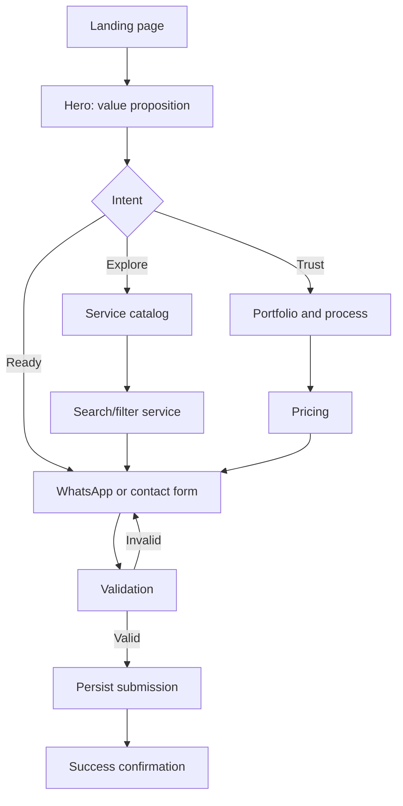

# Product Design Specification — Nexa Studio

## 1. Design direction

Nexa Studio menggunakan karakter **editorial minimalism**: layout bersih,
headline tegas, whitespace luas, cream/white surface, navy sebagai anchor,
dan lime sebagai conversion accent. Visual harus profesional tetapi tetap
hangat untuk pemilik UMKM.

## 2. Primary user flow



## 3. Page inventory

| Surface | Purpose | Key components |
| --- | --- | --- |
| `/` | Acquisition and conversion | Sticky nav, hero, service catalog, portfolio, process, pricing, contact |
| `/admin/login` | Admin authentication | Password form, rate-limit feedback |
| `/admin` | Content and lead operations | ProjectManager, project CRUD, submissions |
| `/api/contact` | Lead intake | JSON validation, anti-spam, persistence, email |
| `/api/health` | Readiness | Database probe and safe status response |
| `/api/live` | Liveness | Process response without database dependency |
| `/privacy` | Data handling disclosure | Explains contact data collection and pending retention decision |

## 4. Homepage wireframe

```text
┌──────────────────────────────────────────────────────────┐
│ Sticky nav: logo | layanan portfolio proses harga | CTA │
├──────────────────────────────────────────────────────────┤
│ Hero copy + primary CTA       Growth dashboard art      │
│ Trust proof: 40+ businesses and performance figures      │
├──────────────────────────────────────────────────────────┤
│ Client logos: PARAS / ruang. / MONO / elara / BRIK      │
├──────────────────────────────────────────────────────────┤
│ Services heading + supporting copy                     │
│ Search input + category pills                          │
│ Service cards / empty result state                     │
├──────────────────────────────────────────────────────────┤
│ Selected work heading + portfolio cards                │
├──────────────────────────────────────────────────────────┤
│ Process introduction       01 / 02 / 03 / 04 list     │
├──────────────────────────────────────────────────────────┤
│ Package prices: Starter / Growth / Custom               │
├──────────────────────────────────────────────────────────┤
│ Dark contact CTA + form                               │
├──────────────────────────────────────────────────────────┤
│ Footer: brand, contact links, social, copyright       │
└──────────────────────────────────────────────────────────┘
```

## 5. Search interaction specification

### Default

- Input berada tepat sebelum service cards.
- Placeholder: `Cari website, branding, atau konten...`.
- Search icon recognizable dan tidak menjadi satu-satunya affordance.
- Category pills menampilkan active state `Semua`.

### Focus

- Border berubah menjadi lime-muted.
- Focus ring empat pixel menggunakan translucent lime.
- Input tetap memiliki contrast dan tidak bergeser.

### Active query

- Filtering dilakukan client-side tanpa request baru.
- Result count diumumkan melalui `aria-live`.
- Clear button muncul dan menghapus query tanpa reload.

### No result

- Jangan tampilkan grid kosong tanpa penjelasan.
- Tampilkan message, hint, dan `Reset pencarian`.

## 6. Contact form behavior

```text
Idle -> user input -> submit
     -> loading (disable fields/button)
     -> success (confirmation + send another)
     -> error (safe message + field-level details)
```

Form memiliki timeout client 15 detik, network error message, honeypot tersembunyi,
token server wajib, dan kunci idempotensi yang dipertahankan saat retry. Success
berarti pesan tersimpan di database, bukan email terkirim. Tautan `/privacy`
menjelaskan pengolahan data; form tidak menampilkan detail internal database/email.

## 7. Responsive behavior

| Breakpoint | Behavior |
| --- | --- |
| 320–639px | Single-column sections, menu mobile buka/tutup, horizontal-scroll filter pills |
| 640–900px | Two-column card grids bila ruang cukup, hero stack |
| 901–1160px | Desktop grid dan two-column hero |
| 1161px+ | Content tetap max-width 1160px untuk readability |

Semua interactive target minimal 44px pada mobile. Decorative elements tidak
boleh memperluas layout viewport.

## 8. Accessibility and content rules

- Gunakan heading order yang konsisten.
- Semua input memiliki label, baik visible maupun visually hidden.
- Status result dan error memakai live region atau `role="alert"`.
- Focus state harus terlihat pada keyboard navigation.
- Hindari placeholder sebagai pengganti label.
- Hormati `prefers-reduced-motion`.
- Jangan menyajikan angka hasil, logo klien, harga, atau “populer” sebagai klaim nyata tanpa bukti dan persetujuan.

## 9. Usability testing plan

1. Minta lima pemilik UMKM mencari layanan untuk kebutuhan website.
2. Ukur time-to-first-relevant-service dan query yang digunakan.
3. Minta user mengirim inquiry dari mobile 320px/375px.
4. Uji error email invalid, message kosong, network timeout, dan no-result.
5. Bandingkan CTA WhatsApp versus form sebagai first action.

## 10. Design rationale

Search ditempatkan setelah service introduction karena user perlu memahami scope
sebelum memfilter. WhatsApp dan contact form dipertahankan bersamaan karena
sebagian visitor ingin percakapan cepat, sementara visitor lain lebih nyaman
menulis brief yang terstruktur.
