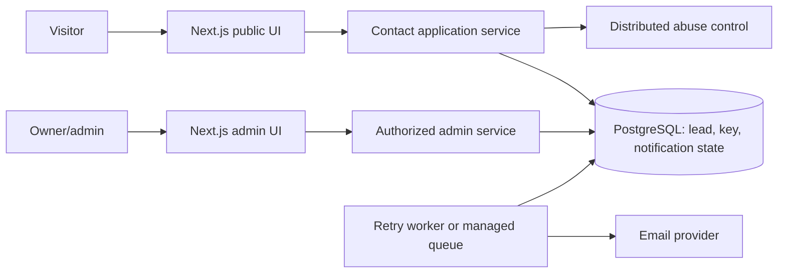

# Implementation Plan — Upgrade Nexa Studio

**Status:** Disetujui pengguna dan diimplementasikan pada workspace lokal. Gerbang CI exact commit, staging, dan production belum diverifikasi; hasil rinci ada di `IMPLEMENTATION_PROGRESS.md`.

**Dibuat:** 2026-09-21 (Asia/Jakarta)

**Baseline code:** `5dfde3bfa03af173d16671a507176e969ff82d37` pada `fix/build-and-bot-audit`.

**Kondisi worktree saat audit:** `session_analysis_report.md` sudah berubah dari pekerjaan sebelumnya; perubahan itu tidak termasuk scope plan ini.

## 1. Tujuan dan batas keputusan

Nexa Studio saat ini adalah website agency fiktif dengan satu landing page, katalog layanan kecil, portofolio dari PostgreSQL, contact form, dan CMS admin dengan satu password. Target upgrade adalah pengalaman yang jujur dan mudah dipakai, lead yang tidak hilang/duplikat, CMS yang aman, dan release yang bisa dibuktikan. Pertahankan Next.js App Router sebagai aplikasi modular; belum ada bukti kebutuhan microservices atau rewrite framework.

Plan ini memisahkan **perbaikan yang dapat diputuskan dari kode** dari **keputusan produk yang harus disetujui pemilik**. Tidak menambahkan checkout, akun klien, CRM penuh, blog, analytics pihak ketiga, atau layanan AI secara otomatis. PRD saat ini menyebut checkout dan akun klien sebagai non-goal; perubahan arah perlu keputusan baru.

### Keputusan produk sebelum fase terkait

| ID | Pertanyaan keputusan | Default sementara untuk perencanaan | Dampak jika diubah |
|:---|:---|:---|:---|
| D1 | Situs tetap portofolio/demo atau akan mewakili agency yang beroperasi? | Perlakukan data seed, logo klien, angka hasil, dan pricing sebagai konten demo yang perlu label jelas | Menentukan copy, klaim, identitas, kebijakan privasi, dan SEO. |
| D2 | Admin hanya satu owner atau beberapa operator dengan audit per orang? | Pertahankan satu owner pada perbaikan segera; rancang migrasi ke identitas per pengguna jika operasi nyata | Menentukan auth provider, session revocation, role, dan audit log. |
| D3 | Apakah notifikasi email wajib, dan apa SLA respons lead? | Database adalah penerimaan lead; email adalah proses terpisah yang dapat diulang | Menentukan outbox, retry, alert, serta pesan sukses. |
| D4 | Gambar proyek berasal dari aset yang direview atau upload admin? | Pilih aset lokal yang sudah direview untuk fase awal | Jika upload, perlu storage, validasi MIME/ukuran, scanning, dan lifecycle. |
| D5 | Apakah harga paket/hasil proyek publik sudah disetujui dan terbukti? | Jangan menganggap angka saat ini sebagai fakta bisnis | Menentukan konten pricing, bukti portofolio, dan struktur data CMS. |

Keputusan D1–D5 adalah gerbang untuk konten/fitur terkait, bukan alasan menunda perbaikan lint, validasi server, dan test harness.

## 2. Bukti baseline

| Pemeriksaan | Hasil pada baseline | Batas bukti |
|:---|:---|:---|
| `npm test` | Exit 0; 7 file, 31 test lulus | Sebagian besar mock/unit; tidak membuktikan DB, Redis, Resend, atau browser nyata. |
| `npx tsc --noEmit` | Exit 0 | Type safety kompilasi saja. |
| `npm run lint` | Exit 1; satu error `react-hooks/set-state-in-effect` di `components/ContactForm.tsx:37` | Lint belum menjadi gate hijau. |
| `npm run build` | Tidak dijalankan | Script saat ini menjalankan `prisma migrate deploy` sebelum `next build`; `.env.local` ada, dan target DB tidak diverifikasi. Menjalankan build dapat mengubah database. |
| `npm run test:e2e` | Tidak dijalankan | Config memulai `npm run start` dan memerlukan build serta layanan yang sesuai. |
| CI, staging, production | Tidak diverifikasi | Tidak ada workflow `.github/workflows` di repository yang diperiksa. Tidak ada bukti exact-commit deployment dalam audit ini. |

Panduan Next.js yang terpasang di `node_modules/next/dist/docs/` telah dibaca untuk Server Actions, Proxy, autentikasi, dan caching. Karena `cacheComponents` tidak aktif di `next.config.mjs`, perancangan cache harus memakai model yang berlaku untuk konfigurasi sekarang atau menjadi migrasi terpisah. Dokumen online resmi yang relevan tercantum di akhir plan.

## 3. Temuan terurut menurut risiko

| ID | Prioritas | Temuan codebase nyata | Risiko / akibat | Target fase |
|:---|:---:|:---|:---|:---:|
| F01 | P0 | `components/ContactForm.tsx:37` mengubah state langsung di effect; lint gagal | Quality gate merah pada HEAD | 0 |
| F02 | P0 | `package.json:11` menggabungkan build dengan `prisma migrate deploy` | Build lokal/CI dapat mengubah DB yang ditunjuk env; release sulit dipisahkan | 0 |
| F03 | P0 | `app/actions/auth.ts:41` menambah counter `admin-login:portal:failed`, tetapi hasilnya tidak dipakai untuk keputusan login | Proteksi global yang diklaim tidak benar-benar membatasi tebakan terdistribusi | 1 |
| F04 | P0 | `app/api/contact/route.ts:144` menerima `renderTime` dari klien bila token tidak ada | Klien dapat mengirim timestamp lama sendiri dan melewati tujuan token server | 1 |
| F05 | P0 | `app/api/contact/route.ts:168` memakai `idempotencyKey` untuk mengambil row tanpa mencocokkan payload; email berikutnya memakai input request baru | Key sama dengan isi berbeda dapat memberi respons untuk lead lama dan membuat notifikasi tidak konsisten | 1 |
| F06 | P0 | `app/api/contact/route.ts:217` mengirim email saat `emailSent=false`, lalu `Promise.race` timeout; tidak ada klaim/lease pengiriman | Retry serentak dapat mengirim ganda; kelanjutan pekerjaan setelah respons pada runtime serverless tidak dijamin | 1 |
| F07 | P1 | `app/actions/submissions.ts:7` mengandalkan union TypeScript tanpa validasi nilai runtime | Panggilan Server Action yang dimanipulasi dapat menyimpan status di luar empat nilai UI | 1 |
| F08 | P1 | Rate limiter fallback ke memori saat Redis gagal; `getClientIp` mengasumsikan header proxy tepercaya (`lib/rate-limit.ts`) | Batas tidak konsisten antar instance dan perilaku saat provider gagal belum diputuskan | 1 |
| F09 | P1 | Session admin berupa HMAC timestamp 7 hari tanpa identitas per operator atau revocation server-side (`lib/admin-session.ts`) | Sulit mencabut satu sesi dan menelusuri perubahan jika situs menjadi operasi nyata | 2, tergantung D2 |
| F10 | P1 | Form tambah proyek tidak menerima gambar, form edit menyimpan `imagePath` di hidden input; schema mengikat tiga CSS class (`ProjectManager.tsx`, `lib/project-validation.ts`) | CMS belum dapat mempublikasikan visual proyek baru secara mandiri | 2, tergantung D4 |
| F11 | P1 | E2E hanya memeriksa elemen, token, login gagal, dan redirect; tidak ada submit sukses atau mutation → reload → persisted state. Test mobile `e2e/admin.spec.ts` mencari `.brand` pada `/admin/login`, padahal halaman login tidak merender class itu | Alur konversi dan CMS belum dibuktikan dari browser; setidaknya satu assertion tampak tidak cocok dengan UI saat ini | 0–2 |
| F12 | P1 | Mobile menyembunyikan `.nav-links` tanpa menu pengganti; “Lihat semua project” menuju `#work` yang sama (`app/page.tsx`, `app/globals.css`) | Navigasi dan CTA tidak memenuhi janji yang ditampilkan | 3 |
| F13 | P1 | README menyebut agency fiktif, sementara homepage menampilkan “40+ bisnis”, logo klien, angka growth, dan contoh hasil seed; Instagram menuju halaman umum (`app/page.tsx`, `prisma/seed.ts`) | Klaim kepercayaan dapat dibaca sebagai fakta yang belum memiliki bukti | 3, tergantung D1/D5 |
| F14 | P2 | Homepage `force-dynamic` dan query proyek langsung di request (`app/page.tsx:6,76`); sitemap memakai `lastModified: new Date()` (`app/sitemap.ts`) | TTFB bergantung DB pada setiap kunjungan dan sinyal perubahan sitemap tidak merepresentasikan perubahan konten | 4 |
| F15 | P2 | `ProjectManager.tsx` sekitar 720 baris dan `globals.css` sekitar 404 baris dengan banyak inline style dan aturan mobile tersebar | Perubahan UI/CMS mahal direview dan rentan regresi visual | 2–3 |
| F16 | P2 | `.env.example`, README, PRD, Architecture masih menjelaskan beberapa perilaku lama dan belum menyertakan konfigurasi Redis yang dipakai kode | Setup/release bisa salah meski kode lolos unit test | 0 dan tiap fase |

Prioritas adalah penilaian audit, bukan bukti eksploitasi di production. F03–F08 memerlukan regression test yang menyerang kontrak, bukan sekadar mengecek fungsi mock dipanggil.

## 4. Peta route, aset, dan interaksi

### Route dan data

| Surface | Sumber data / kontrol sekarang | Target perilaku dan bukti |
|:---|:---|:---|
| `/` | Service/pricing statis; project dari Prisma; CTA WhatsApp/form | Render responsif, copy disetujui, daftar proyek deterministik, CTA mencapai tujuan; uji mobile 320px dan desktop. |
| `/admin/login` | Satu password env; Server Action; cookie signed | Limit login terukur tanpa lockout massal, error aman, session dapat diuji expiry/rotation; browser login sukses/gagal. |
| `/admin` | Project CRUD dan inbox/status dari Prisma; Proxy + auth di page/action | Semua mutasi tervalidasi di server; create/edit/delete/status → reload → state menetap; halaman tak dapat dibuka tanpa sesi. |
| `POST /api/contact` | Zod, token/renderTime, rate limit, Prisma, Resend | Satu submission per key dan payload; payload berbeda ditolak; retry paralel aman; respons sukses berarti lead tersimpan. |
| `GET /api/anti-spam` | Token HMAC server | Token memiliki lifetime/validasi yang sama di semua instance; endpoint tidak menjadi bypass. |
| `GET /api/health` | `SELECT 1` ke database | Readiness DB tetap ada; liveness terpisah bila dibutuhkan; tidak membocorkan detail internal. |
| `/robots.txt`, `/sitemap.xml` | Metadata route, URL env/default | Domain canonical benar, admin tidak terindeks, tanggal hanya berubah sesuai konten bila digunakan. |
| Error/loading | Komponen global/admin | Pemulihan keyboard/screen reader dan state error tanpa informasi sensitif. |

### Aset dan klaim

| Aset/konten | Kondisi sekarang | Tindakan terencana |
|:---|:---|:---|
| Tiga JPEG `public/projects/*` | Dipakai seed; kredit Unsplash ada di README | Pertahankan kredit/sumber; verifikasi hak pakai dan kesesuaian dengan label demo sebelum publish nyata. |
| SVG bawaan `public/{file,globe,next,vercel,window}.svg` | Tidak dirujuk dari UI yang diperiksa | Hapus hanya setelah pencarian referensi akhir dan review aset. |
| Favicon/brand N | Ada, tetapi tidak mewakili paket identitas lengkap | Siapkan favicon/OG image dan ekspor ukuran yang disetujui di fase visual. |
| Angka, logo, pricing, hasil proyek | Statis/contoh, tanpa bukti sumber bisnis di repo | Label demo atau ganti dengan konten yang disahkan; jangan menciptakan metrik. |

### Interaksi yang harus tetap bekerja

| Interaksi | Saat ini | Upgrade / acceptance |
|:---|:---|:---|
| Search/filter layanan | Client-side, tiga service, empty/reset tersedia | Keyboard, empty state, hasil konsisten, uji aksesibilitas. |
| CTA WhatsApp dan paket | Link WA; paket ke `#contact` tanpa konteks paket | URL valid dari konfigurasi; bila disetujui, bawa konteks paket ke form/WA dan uji. |
| Navigasi mobile | Link utama disembunyikan | Menu yang bisa dibuka/tutup dengan keyboard dan screen reader. |
| Form kontak | Request JSON, 15 detik timeout, key per form | Validasi konsisten, token server wajib, retry aman, feedback yang sesuai status persistence. |
| Admin CRUD/status | Server Actions; sebagian status langsung di UI | Validasi input runtime dan uji mutation → reload → persisted state. |
| Project image | Seed-only untuk gambar baru | Pilihan aset terkelola atau upload aman sesuai D4. |

## 5. Arsitektur target yang proporsional

Pisahkan validation, data access, dan delivery contract di dalam aplikasi yang sama. Database menjadi sumber kebenaran lead dan idempotency. Notification state perlu transisi eksplisit (`pending` → `sending`/lease → `sent` atau `retryable_failed`) dan retry terjadwal bila D3 menuntut pengiriman andal. Redis hanya untuk kontrol abuse/queue bila konfigurasi dan kebutuhan nyata membenarkan; tidak menjadi sumber kebenaran submission. Tidak ada kebutuhan membuat microservice baru hanya demi struktur.

## 6. Fase implementasi dan acceptance

Setiap fase adalah PR/review terpisah. Setelah tiap fase, catat SHA, diff, command/exit code, bukti browser, hasil CI pada SHA itu, serta hasil staging bila perilaku eksternal disentuh. Jangan menyebut production-ready dari hasil lokal.

### Fase 0 — Baseline yang dapat dipercaya

**Scope:** F01, F02, F11 (harness), F16. Ubah `ContactForm.tsx` agar key diinisialisasi tanpa synchronous setState di effect; pisahkan `build` (`prisma generate && next build`) dari command migrasi eksplisit; tambah workflow CI untuk clean install, Prisma generate, lint, typecheck, Vitest, build, dan Playwright yang memakai DB fixture terisolasi. Perbarui `.env.example`, README, PRD, Architecture agar cocok dengan kode.

**Acceptance:** lint/typecheck/Vitest/build exit 0 pada clean workspace dan exact commit; CI tidak memakai DB production; migrasi dijalankan hanya di stage deploy yang jelas; `git diff --check` bersih. Browser smoke minimal menunjukkan `/`, redirect `/admin`, dan form visible. Tidak menjalankan `migrate deploy` terhadap `.env.local` yang targetnya tidak diketahui.

### Fase 1 — Integritas dan keamanan alur kontak/login

**Scope:** F03–F08. Definisikan shared schema server untuk status submission dan kunci idempotency. Simpan fingerprint payload bersama key atau batasi key ke payload yang sama; key yang sama dengan payload berbeda mengembalikan konflik tanpa kirim email. Hilangkan fallback timestamp klien setelah migrasi kompatibilitas yang eksplisit. Pastikan proteksi login benar-benar mengonsumsi keputusan pembatasan tanpa menjadikan counter global sebagai alat lockout semua admin. Audit trusted proxy/IP berdasarkan konfigurasi deployment. Terapkan state notifikasi yang dapat diklaim atomik dan retry sesuai D3.

**Acceptance:** integration test dengan DB terisolasi untuk same-key/same-payload, same-key/different-payload, 20–50 request paralel, email provider gagal/timeout, dan tepat satu hasil persistence; tes provider limiter gagal serta spoofed headers; unauthorized dan forged Server Action input ditolak. Pada staging, cek Resend/Redis asli dan log delivery tanpa memuat isi pesan atau rahasia. Jika D3 memilih notifikasi best-effort, dokumen/UI harus menyatakan batasnya secara akurat.

### Fase 2 — CMS dan model operasi

**Scope:** F09, F10, F15 bagian admin. Pecah `ProjectManager` menjadi form, list, inbox, dan pagination dengan shared field components. Beri label `htmlFor`/`id` pada field. Pilih katalog aset yang direview atau upload aman sesuai D4; tambah preview dan validasi file/path yang sesuai. Stabilkan sort `order` dengan tie-breaker. Untuk operasi nyata dan multi-operator (D2), migrasikan ke identitas per pengguna, revocable session, role minimum, dan audit metadata; untuk demo owner tunggal, dokumentasikan batas serta rotasi secret.

**Acceptance:** create/edit/delete project dan update status terlihat sama setelah reload; image yang dipilih muncul di homepage; validasi server menolak ID/status/path tak sah; layout admin 320px tanpa horizontal scroll; keyboard dapat menyelesaikan form dan dialog. Migrasi data harus additive, diuji dengan data fixture, serta punya rollback yang mempertahankan data.

### Fase 3 — Pengalaman pengunjung, konten, dan aksesibilitas

**Scope:** F12, F13, F15 bagian publik. Bangun mobile navigation yang nyata, rapikan CTA “semua project” agar menuju route/daftar yang memang ada, dan putuskan apakah perlu halaman detail portofolio berdasarkan D1/D5. Audit hero, trust strip, pricing, kontak, metadata, dan JSON-LD terhadap konten yang disahkan. Pertahankan identitas visual cream/navy/lime hingga pemilik menyetujui arah baru. Konsolidasikan token/style bertahap tanpa mengubah alur kontak.

**Acceptance:** matriks layar 320/375/768/1440px dan keyboard-only untuk semua CTA/form; uji screen reader dan automated accessibility terhadap target WCAG 2.2 AA yang relevan; reduced-motion bekerja; setiap tautan publik menuju tujuan yang nyata. Screenshot light/render setiap surface sebelum/sesudah dan bukti konten klaim/izin aset. Jangan mengganti angka demo dengan angka baru yang dikarang.

### Fase 4 — Kinerja, observability, dan release

**Scope:** F14 dan gap operasional. Ukur TTFB/Core Web Vitals sebelum memilih cache untuk query Prisma; bila sesuai, cache data portofolio dengan invalidasi mutation menurut model Next.js yang terpasang. Pisahkan readiness database dari liveness, tambah error/latency telemetry minim PII, backup/restore drill, retention lead, dan runbook incident. Atur sitemap `lastModified` dari perubahan konten yang nyata atau hilangkan field jika tidak tersedia. Siapkan staging dengan DB/email/Redis terpisah dan promotion gate berbasis exact commit.

**Acceptance:** angka performa baseline dan sesudah di perangkat/lokasi yang dicatat; tidak ada stale project setelah admin mutation; audit accessibility/performance desktop dan mobile; migrasi staging, E2E staging, dan rollback dry run terdokumentasi. Production baru dinilai setelah exact-commit CI, staging, konfigurasi provider, dan live smoke test punya bukti terpisah.

## 7. Urutan kerja, risiko, dan trade-off

1. **Mulai dari Fase 0** karena lint merah dan build bercampur migrasi membuat bukti berikutnya sulit dipercaya.
2. **Fase 1 sebelum visual besar** karena pengunjung sudah dapat memakai contact form dan admin login; data/abuse adalah jalur paling sensitif.
3. **Fase 2 bergantung D2/D4**; implementasi owner tunggal lebih kecil, sedangkan identitas per orang dan upload menambah biaya operasional.
4. **Fase 3 bergantung D1/D5**; konten dan klaim publik membutuhkan persetujuan produk.
5. **Fase 4 mengoptimasi hasil ukur**, bukan menyalakan cache atau menambah dependency tanpa baseline.

Trade-off utama: notification outbox menambah state dan worker/scheduler tetapi memberi delivery yang bisa diaudit; managed auth menambah provider/biaya tetapi memberi sesi dan MFA yang lebih matang; cache mengurangi beban DB tetapi memperkenalkan invalidasi. Pilih setelah kebutuhan bisnis dan staging dibuktikan.

### Perkiraan kompleksitas teknis

Query proyek saat ini membaca seluruh daftar: waktu dan payload **O(P)** untuk P proyek. Admin pagination membaca 20 submission per halaman, namun offset besar tetap dapat menjadi mahal di database; keyset pagination layak jika volume benar-benar tumbuh. Fallback rate limiter memindai seluruh `Map` pada tiap request: **O(K)** waktu untuk K key, dan pada overflow melakukan sort **O(K log K)**; target perbaikan adalah operasi key lokal/Redis dengan biaya sekitar **O(1)** per permintaan pada jalur normal. Angka kapasitas dan SLA tidak ditetapkan tanpa traffic nyata.

## 8. Referensi resmi untuk keputusan implementasi

- [Next.js Authentication](https://nextjs.org/docs/app/guides/authentication) dan [Data Security](https://nextjs.org/docs/app/guides/data-security): validasi/auth setiap Server Action dan Route Handler; Proxy hanya pemeriksaan awal.
- [Next.js caching untuk konfigurasi tanpa Cache Components](https://nextjs.org/docs/app/guides/caching-without-cache-components): model cache yang cocok dengan `next.config.mjs` sekarang.
- [OWASP Business Logic Security](https://cheatsheetseries.owasp.org/cheatsheets/Business_Logic_Security_Cheat_Sheet.html) dan [Authentication](https://cheatsheetseries.owasp.org/cheatsheets/Authentication_Cheat_Sheet.html): idempotency, concurrency, dan login throttling.
- [Prisma migrate deploy](https://docs.prisma.io/docs/cli/migrate) dan [deploy migrations via CI/CD](https://docs.prisma.io/docs/orm/prisma-client/deployment/deploy-migrations-from-a-local-environment): pisahkan migrasi dari build umum.
- [W3C WCAG 2.2](https://www.w3.org/TR/wcag/) dan [Next.js production guide](https://nextjs.org/docs/app/guides/production-checklist): acceptance aksesibilitas, performa, dan release.
