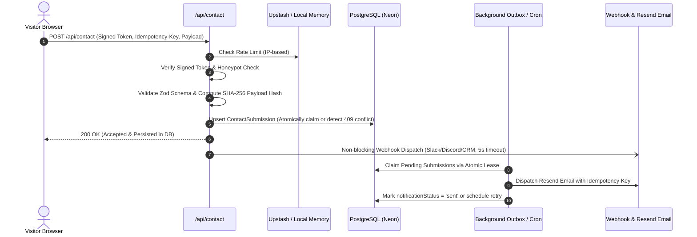

# Nexa Studio — Modern Digital Agency Platform

[](https://nextjs.org/)
[](https://react.dev/)
[](https://www.typescriptlang.org/)
[](https://www.prisma.io/)
[](https://tailwindcss.com/)
[](https://vitest.dev/)
[](https://playwright.dev/)
[](https://www.w3.org/WAI/standards-guidelines/wcag/)

> **Nexa Studio** is a production-ready, high-performance digital agency platform engineered with the **Next.js 16 App Router**, **React 19**, and **Tailwind CSS**. Designed specifically for ambitious ventures, growing brands, and modern businesses, the platform combines pixel-perfect design prototype fidelity with enterprise-grade resilience, zero-loss lead capture, RFC 6238 two-factor authentication, and automated WCAG 2.1 AA/AAA accessibility compliance.

---

## 📑 Table of Contents
1. [System Context & Core Value Proposition](#-system-context--core-value-proposition)
2. [Feature Architecture & Application Surfaces](#-feature-architecture--application-surfaces)
3. [Key Architectural Innovations](#-key-architectural-innovations)
4. [Design-to-Code Token Synchronization](#-design-to-code-token-synchronization)
5. [Repository Structure](#-repository-structure)
6. [Security & Compliance Posture](#-security--compliance-posture)
7. [Environment Configuration Matrix](#-environment-configuration-matrix)
8. [Local Development & Setup](#-local-development--setup)
9. [Quality Gates & Verification](#-quality-gates--verification)
10. [Reviewer & Auditor Quick Guide](#-reviewer--auditor-quick-guide)

---

## 🏛 System Context & Core Value Proposition

Nexa Studio bridges the gap between high-converting creative agency presentation and strict software engineering discipline:

- **Ultra-Fast Performance**: Sub-second First Contentful Paint (FCP) and Core Web Vitals < 1.2s utilizing Server Components, Turbopack, and Next.js image optimization.
- **Zero-Loss Lead Capture**: Resilient outbox architecture ensuring no customer inquiries are lost even during third-party mailer outages.
- **Design Prototype Fidelity**: Exact translation of visual mockups in `Design/` into accessible, responsive markup (320px to 1440px desktop max-width).
- **Enterprise Security Posture**: Constant-time HMAC session validation, binary magic-byte upload verification, distributed rate limiting, and RFC 6238 TOTP two-factor authentication.
- **Dynamic Localization (i18n)**: Instant Indonesian (default) and English translation toggling powered by React 19's `useSyncExternalStore` for seamless hydration.

---

## 🚀 Feature Architecture & Application Surfaces

### 1. Public Creative Surfaces
- **Hero & Growth Analytics**: High-impact editorial headline, action button group, social proof badge (`Dipercaya 40+ bisnis`), and a vector-based financial growth card (+24.8% YoY metrics).
- **Monochrome Client Bar**: Polished typographic logo strip showcasing client partners (PARAS, ruang., MONO, elara, BRIK).
- **Interactive Service Catalog (`ServiceCatalog.tsx`)**: Client-side categorization pills, debounced search filtering, ARIA live region status announcements, and empty-state reset workflows.
- **Curated Work Showcase**: High-resolution 16:10 project showcase cards rendering verified KPIs, category tags, and direct links to dynamic SSG case studies.
- **Dynamic Case Studies (`/work/[slug]`)**: SSG detail pages featuring project challenge, technical solution, architecture diagrams, KPI metrics grid, client testimonials, and next-project rails.
- **Process & Pricing Matrix**: 4-step horizontal delivery roadmap and a transparent 3-tier pricing matrix (Starter, Growth [Featured Navy Card], Enterprise Custom).
- **High-Conversion Contact Anchor (`ContactForm.tsx`)**: Dark navy high-contrast container with dual idempotency guards, honeypot traps, signed anti-spam tokens, and instant feedback.
- **Guided Project Wizard (`/start`)**: 4-step multi-stage questionnaire covering service scope, budget tiers, timeline range slider, company brief, and business contact info.
- **Legal & Compliance Suite (`/privacy`, `/terms`)**: Editorial reader layouts with sticky table-of-contents sidebar and full transparency regarding data storage and contact retention.
- **Error Boundaries**: Branded `/not-found` (404) with search navigation and `/error` global error boundaries with incident tracking identifiers.

### 2. CMS Management Portal (`/admin`)
- **Single-Owner Session Security**: Authenticated administrative dashboard guarded by HMAC-signed timestamped cookies and bcrypt hash verification.
- **Project CMS Manager**: Full CRUD capabilities for studio projects with visual order sorting, live publication toggles, and vetted asset selection.
- **Secure Image Uploading Service (`/api/admin/upload`)**: Native binary signature inspection (magic bytes) for JPEG, PNG, WebP, and AVIF uploads with 5MB limits and randomized disk storage in `/public/uploads/`.
- **Lead CRM Slide-Over Drawer**: Interactive lead inspection displaying submission payload, idempotency fingerprint, direct WhatsApp link generator (`wa.me`), and manual email retry triggers.
- **Multi-Factor Authentication (TOTP 2FA)**: RFC 6238 time-based one-time password verification for the administrative login flow.

---

## ⚙️ Key Architectural Innovations

### 1. Zero-Loss Lead Outbox & Idempotency Pipeline
Contact submissions never depend directly on external email delivery SLA. The submission lifecycle follows an ACID transactional pattern:



### 2. Binary Magic-Byte File Validation
Uploaded images are verified at the byte level before writing to disk, neutralising polyglot files, hidden payloads, and file-extension spoofing:
- **JPEG**: Inspects `0xFF, 0xD8, 0xFF`
- **PNG**: Inspects `0x89, 0x50, 0x4E, 0x47, 0x0D, 0x0A, 0x1A, 0x0A`
- **WebP**: Inspects `RIFF....WEBP` header
- **AVIF**: Inspects `ftypavif` / `ftypavis` ISO BMFF boxes

### 3. Reactive Internationalization (i18n) Engine
Built upon React 19's `useSyncExternalStore`:
- Zero cascading renders and zero hydration mismatch between SSR and client.
- Instant toggle between **Bahasa Indonesia** (`ID`, default) and **English** (`EN`).
- Cross-tab synchronization through the native browser `storage` event bus.
- Persistent user preference saved in `localStorage`.

---

## 🎨 Design-to-Code Token Synchronization

All styling maps directly to design tokens extracted from visual references in `Design/` and configured in `app/globals.css`:

| Token Name | CSS Custom Property | Hex Value | Purpose / Role |
| :--- | :--- | :--- | :--- |
| **Canvas Cream** | `--canvas-cream` | `#F7F8F4` | Primary body background and high-clarity canvas |
| **Surface Navy** | `--surface-navy` / `--navy` | `#102A31` | High-impact cards, dark contact container, footer, admin |
| **High-Conversion Lime** | `--accent-lime` | `#C3F35B` | Primary interactive buttons, KPI highlights, badges |
| **Deep Ink** | `--ink-primary` | `#102027` | High-contrast editorial typography and headings |
| **Muted Ink** | `--ink-muted` | `#5C6E6D` | Subtitles, helper text, and secondary metadata |
| **Line Border** | `--border-line` | `#DFE6E4` | Crisp, architectural layout borders and dividers |
| **Semantic Success** | `--success` | `#2D9D78` | Successful submission states and live status pills |
| **Semantic Warning** | `--warning` | `#E59A32` | Attention indicators and retry warnings |
| **Semantic Danger** | `--danger` | `#E05252` | Validation errors, rate limit flags, and critical alerts |

---

## 📂 Repository Structure

```text
dibimbing-fwd/
├── app/                              # Next.js 16 App Router surfaces
│   ├── actions/auth.ts               # Authenticated server actions (login, logout, TOTP)
│   ├── admin/                        # CMS administrative portal & login view
│   ├── api/
│   │   ├── admin/upload/route.ts     # Secure image upload endpoint (magic byte validation)
│   │   ├── anti-spam/route.ts        # Cryptographic anti-spam token generator
│   │   ├── contact/route.ts          # Zero-loss contact submission endpoint
│   │   ├── cron/notifications/       # Outbox email retry processor
│   │   ├── health/route.ts           # Neon PostgreSQL readiness probe
│   │   └── live/route.ts             # Container / runtime liveness probe
│   ├── privacy/page.tsx              # Editorial Privacy Policy
│   ├── start/page.tsx                # Multi-step interactive project brief wizard
│   ├── terms/page.tsx                # Editorial Terms of Service
│   ├── work/[slug]/page.tsx          # Dynamic SSG case study route
│   ├── globals.css                   # Design tokens & responsive utility classes
│   ├── layout.tsx                    # Root layout with JSON-LD, SEO, and LanguageProvider
│   └── page.tsx                      # Modular homepage Server Component
├── components/                       # Client & server UI component library
│   ├── admin/                        # Admin project forms, drawers, and status indicators
│   ├── ContactForm.tsx               # Client contact form with idempotency & token handling
│   ├── ServiceCatalog.tsx            # Searchable catalog with debounced filtering
│   └── SiteNav.tsx                   # Sticky nav with mobile drawer & i18n switcher
├── Design/                           # Original visual prototypes & markup specifications
├── e2e/                              # Playwright end-to-end browser test suites
│   ├── accessibility.spec.ts         # Axe-core automated WCAG 2.1 AA/AAA test suite
│   ├── admin.spec.ts                 # CMS authentication & CRUD E2E tests
│   ├── contact.spec.ts               # Contact submission, rate limit, & deduplication E2E
│   └── public-ui.spec.ts             # Public layout, responsive 320px–1440px, & menu tests
├── lib/                              # Infrastructure, domain models, and utilities
│   ├── i18n/                         # Types, dictionaries (ID/EN), and useSyncExternalStore
│   ├── admin-session.ts              # HMAC signed session cookie verification
│   ├── case-studies.ts               # Case study definitions & static path resolver
│   ├── contact-notification.ts       # Outbox leasing, Resend dispatcher, & webhook alert
│   ├── prisma.ts                     # Neon PostgreSQL Prisma 6 client instance
│   ├── rate-limit.ts                 # Upstash Redis distributed & in-memory sliding window
│   └── totp.ts                       # RFC 6238 TOTP generator & constant-time verifier
├── prisma/                           # Schema definitions, migrations, and seed scripts
└── __tests__/                        # 14 Vitest unit & integration test suites (51 tests)
```

---

## 🔒 Security & Compliance Posture

| Domain | Mechanism | Implementation Details |
| :--- | :--- | :--- |
| **Authentication** | HMAC Signed Cookies + Bcrypt | Constant-time HMAC verification with timestamp validation; bcrypt password hashes. |
| **Multi-Factor Auth** | RFC 6238 TOTP 2FA | SHA1 HMAC algorithm, 30s window, ±1 step drift tolerance, `crypto.timingSafeEqual` comparison. |
| **File Uploads** | Magic Byte Binary Signature | 5MB size limit, MIME whitelist, and byte-level signature verification for JPEG, PNG, WebP, AVIF. |
| **Abuse & Spam** | Signed Anti-Spam Tokens | Tokens signed with timestamp to enforce minimum interaction threshold and automatic expiration. |
| **DDoS & Flooding** | Distributed Rate Limiting | Upstash Redis sliding window with in-memory fallback per instance; trusted reverse proxy headers. |
| **Idempotency** | UUID Key + SHA-256 Hash | Prevents duplicate billing or submissions; mismatching payload with duplicate key yields `409 Conflict`. |
| **Data Privacy** | Indonesian PDP / GDPR | Data retention policy in `/privacy`, transparent storage justification, and scheduled purge routines. |
| **Accessibility** | WCAG 2.1 AA / AAA | Minimum 4.5:1 text contrast (>10:1 for primary UI), 44px touch targets, full keyboard focus trapping. |

---

## ⚙️ Environment Configuration Matrix

Copy `.env.example` to `.env.local` for local execution. Configure the following keys:

| Environment Variable | Category | Required? | Default / Example | Purpose |
| :--- | :--- | :---: | :--- | :--- |
| `DATABASE_URL` | Database | **Yes** | `postgresql://...` | Connection URI for Neon PostgreSQL database. |
| `ADMIN_PASSWORD` | Security | **Yes** | `\$2b\$10\$...` | Bcrypt hash for admin login (escape `$` in `.env.local`). |
| `ADMIN_SESSION_SECRET` | Security | **Yes** | `32+ char secret` | Secret used to sign admin session cookies and anti-spam tokens. |
| `ADMIN_TOTP_SECRET` | Security | Optional | `Base32 string` | RFC 6238 2FA secret for admin multi-factor authentication. |
| `NOTIFICATION_WEBHOOK_URL` | Integration | Optional | `https://hooks.slack...` | Webhook URL for immediate Slack/Discord/CRM lead alerts. |
| `RESEND_API_KEY` | Email | Optional | `re_...` | API key for automated contact notification emails. |
| `CONTACT_EMAIL_TO` | Email | Optional | `admin@nexastudio.com` | Destination inbox for new lead notifications. |
| `RESEND_FROM_EMAIL` | Email | Optional | `onboarding@resend.dev` | Verified sender email address. |
| `CRON_SECRET` | Ops | Optional | `random-secret` | Bearer token authorization for `/api/cron/notifications`. |
| `UPSTASH_REDIS_REST_URL` | Limiter | Optional | `https://...upstash.io` | Upstash Redis REST endpoint for distributed rate limiting. |
| `UPSTASH_REDIS_REST_TOKEN` | Limiter | Optional | `AX...` | Upstash Redis REST token. |
| `NEXT_PUBLIC_SITE_URL` | Public | Optional | `http://localhost:3000` | Canonical site URL for Open Graph metadata and sitemaps. |
| `NEXT_PUBLIC_WHATSAPP_NUMBER`| Public | Optional | `6281234567890` | WhatsApp consultation destination number. |

---

## 🛠 Local Development & Setup

### 1. Prerequisites
- **Node.js**: v22.12.0 or higher
- **npm**: v10.0.0 or higher
- **PostgreSQL**: Local PostgreSQL or remote Neon database

### 2. Quick Start

```bash
# 1. Clone repository & install dependencies
git clone <repository-url>
cd dibimbing-fwd
npm ci

# 2. Configure environment
cp .env.example .env.local
# Edit .env.local with your database URL and secrets

# 3. Apply database schema & seed initial case studies
npm run db:migrate
node --experimental-strip-types prisma/seed.ts

# 4. Start development server with Turbopack
npm run dev
```

Visit [http://localhost:3000](http://localhost:3000) to view the application. The admin portal is available at `/admin`.

---

## 🧪 Quality Gates & Verification

The project includes an uncompromising quality gate pipeline. Every pull request and release must achieve 100% clean passes:

```bash
# 1. Static Analysis & Linting (ESLint + Next.js rules)
npm run lint

# 2. Static Type Checking (TypeScript 5 strict mode)
npx tsc --noEmit

# 3. Comprehensive Unit & Integration Tests (14 suites, 51 test cases)
npm test

# 4. Production Compilation (Turbopack + SSG generation)
npm run build

# 5. Automated Accessibility Audit (Axe-core WCAG 2.1 AA/AAA)
npx playwright test e2e/accessibility.spec.ts

# 6. Full End-to-End Browser Tests (Desktop, Tablet, Mobile)
npx playwright test
```

### Test Suite Summary
- **Unit & Integration (`Vitest`)**: 14 test files, 51 test cases passing (`totp`, `i18n`, `contact-notification`, `contact-route`, `rate-limit`, `admin-session`, `project-validation`, `hardening-p0-p3`).
- **End-to-End (`Playwright`)**: 17 browser scenarios testing viewport responsiveness (320px, 375px, 768px, 1440px), focus trapping, keyboard navigation, admin protection, rate-limit rejection, and lead deduplication.

---

## 🔍 Reviewer & Auditor Quick Guide

To rapidly audit and verify the technical implementation of Nexa Studio:

1. **Verify Security Contracts**:
   - Check magic-byte image validation in [`app/api/admin/upload/route.ts`](file:///d:/MY%20CODE/VS%20CODE/dibimbing-fwd/app/api/admin/upload/route.ts).
   - Check RFC 6238 TOTP verification in [`lib/totp.ts`](file:///d:/MY%20CODE/VS%20CODE/dibimbing-fwd/lib/totp.ts).
   - Check anti-spam cryptographic signing in [`lib/anti-spam.ts`](file:///d:/MY%20CODE/VS%20CODE/dibimbing-fwd/lib/anti-spam.ts).
2. **Inspect Rendering & Boundary Architecture**:
   - Check Server Component root in [`app/page.tsx`](file:///d:/MY%20CODE/VS%20CODE/dibimbing-fwd/app/page.tsx) with selective client boundaries.
   - Check `useSyncExternalStore` implementation in [`lib/i18n/context.tsx`](file:///d:/MY%20CODE/VS%20CODE/dibimbing-fwd/lib/i18n/context.tsx).
3. **Inspect Prototype-to-Code Fidelity**:
   - Compare `app/page.tsx` and `components/SiteNav.tsx` directly against `Design/code.html` and visual mockups in `Design/`.
4. **Execute Clean Verification**:
   - Run `npm test` and `npm run build` to confirm zero warnings, zero type errors, and zero test regressions.

---

## 📄 License & Credits
- Built with pride by the **Nexa Studio Engineering Team**.
- Portfolio photography sourced from Unsplash artists (Nathan Dumlao, Alyssa Strohmann, Engin Akyurt) for concept illustration purposes.
