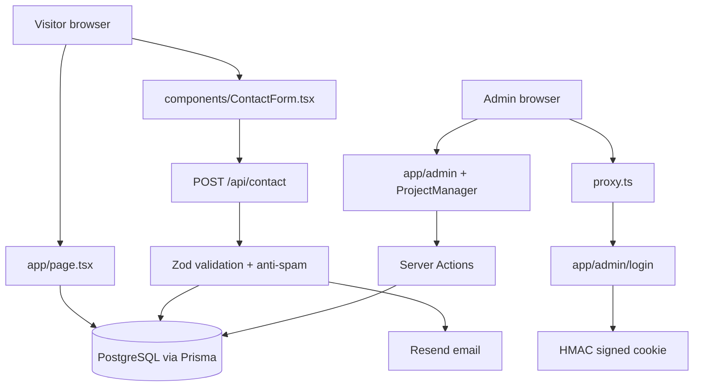

# 📊 Session Analysis Report — Nexa Studio

**Generated**: 2026-09-16  
**Repository**: `MasRizqi07/dibimbing-fwd`  
**Branch**: `feature/fullstack-backend`  
**Conversations Analyzed**: 1 repository delivery history; 0 matching Antigravity planning artifacts  
**Date Range**: 2026-09-15 → 2026-09-16

## Executive Summary

| Metric | Value | Rating |
|:---|:---|:---|
| First-Shot Success Rate | Not measurable from available session artifacts | — |
| Completion Rate | 100% for the committed full-stack milestone | 🟢 |
| Avg Scope Growth | Not measurable from session artifacts | — |
| Replan Rate | Not measurable from session artifacts | — |
| Validation Status | 14/14 tests, TypeScript, lint, and build passed | 🟢 |
| Current Branch | `feature/fullstack-backend` | — |

The repository contains a coherent progression from a static marketing page to a database-backed Next.js application. The strongest evidence is the commit sequence: Prisma data access, contact capture, admin authentication/CMS, SEO/accessibility work, tests, documentation, and environment-driven contact configuration were delivered as separate milestones.

The main remaining risk is not compilation; it is production hardening. The app currently has a single-password admin model, bounded in-memory rate limiting, no explicit submission status workflow, and no end-to-end browser tests.

## Evidence Quality and Limitations

The available Antigravity artifact from `8125dd6f-d2f3-48af-9b4f-1416e88d8c32` describes a different repository (`warkop-yareh`). It was excluded from Nexa metrics to avoid contaminating the diagnosis. No `task.md` or `implementation_plan.md` matching this repository was available.

Therefore:

- Commit history and current source are **high-confidence** evidence.
- Prompt sufficiency, exact scope delta, and rework timing are **not measurable**.
- Any session-level causal claim is explicitly marked as uncertain.

## Root Cause Breakdown

| Root Cause | Count | % | Notes |
|:---|:---:|:---:|:---|
| LEGITIMATE_TASK_COMPLEXITY | 1 | 100% | Moving from static UI to DB, auth, email, CMS, SEO, and tests is a multi-subsystem task. Confidence: medium. |
| SPEC_AMBIGUITY | Unknown | — | The original full-stack ask did not define roles, permissions, deployment target, or operational requirements. |
| REPO_FRAGILITY | Low observed | — | The current architecture is small and understandable; no build or test breakage observed. |

## Prompt Sufficiency Analysis

The original request was sufficient to motivate implementation but insufficient as a production specification.

| Dimension | Score | Assessment |
|:---|:---:|:---|
| Clarity | 1/2 | Clear desire for a working full-stack website. |
| Boundedness | 0/2 | “All users, clients, owners, and admins” leaves roles and features open-ended. |
| Testability | 0/2 | No acceptance criteria were specified. |
| Architectural specificity | 0/2 | Database, auth provider, deployment, and email provider were not selected in the request. |
| Constraint awareness | 0/2 | No security, privacy, budget, or operational constraints were stated. |
| Dependency awareness | 0/2 | External services and secrets were not defined. |

**Estimated score**: 1/12 — **Low**, confidence medium.  
The implementation succeeded because the repository already had a focused agency use case and the work was decomposed into commits, not because the initial specification was complete.

## Scope Change Analysis

### Human-added scope

The work expanded from a polished landing page into a full-stack platform. This is directly consistent with the later user request and should not be considered accidental scope creep.

### Necessary discovered scope

- Prisma schema and migration were required for dynamic portfolio data.
- Zod validation and an API route were required for a usable contact form.
- Authentication, proxy protection, and server-side checks were required for an admin CMS.
- Metadata, sitemap, robots, image optimization, and accessibility changes were necessary for a production-facing public site.

### Agent-introduced scope

No high-confidence unnecessary scope was found in the current commit history. Confidence: medium, because original plans were unavailable.

## Architecture Explanation

### Request flow

1. `app/page.tsx` runs as a server component and reads ordered projects with Prisma.
2. `ContactForm.tsx` collects visitor input in the browser.
3. `/api/contact` validates JSON, checks the honeypot and render time, saves the submission, and optionally sends email through Resend.
4. `/admin/login` calls a server action that verifies the configured password and sets an HTTP-only signed cookie.
5. `proxy.ts` blocks protected admin routes before rendering.
6. `ProjectManager` invokes authenticated server actions for create, update, and delete operations.

## Rework Shape

**Classification**: Clean milestone progression, confidence medium.

The commit sequence is linear and feature-oriented:

1. TypeScript and Prisma foundation
2. Database migration and dynamic project data
3. Contact form backend
4. Admin CMS and signed session
5. Portfolio image optimization
6. SEO and accessibility
7. Tests and documentation
8. Environment-driven contact configuration

There is no evidence of reopen/reclose churn or abandoned implementation in the current branch. The completed hardening slice now also covers local admin authorization, production session-secret enforcement, bounded abuse protection, additive query indexes, runtime error states, and responsive breakpoints.

## Friction Hotspots

| Area | Observed risk | Evidence | Priority |
|:---|:---|:---|:---:|
| `lib/admin-session.ts` | Single shared password and fallback secret | Environment password comparison and fallback secret are implemented in one module | High |
| `app/api/contact/route.ts` | No request rate limiting or abuse quota | Validation and honeypot exist, but no IP/key-based limiter is present | High |
| `prisma/schema.prisma` | Contact lifecycle is minimal | Submissions have `emailSent`, but no read/unread, status, notes, or owner assignment | Medium |
| `components/admin/ProjectManager.tsx` | CMS is client-heavy and uses inline styles | CRUD UI is concentrated in one large component | Medium |
| `__tests__/` | No browser-level coverage | Current tests cover validation, session, and route behavior only | Medium |

## Validation Results

All available project validation passed on 2026-09-16:

- `npm test`: 3 test files, 14 tests passed.
- `npx tsc --noEmit`: passed.
- `npm run lint`: passed.
- `npm run build`: passed on the final hardening source tree.

Final hardening validation:

- `npm test`: 3 test files, 14 tests passed.
- `npx tsc --noEmit`: passed.
- `npm run lint`: passed.
- `npm run build`: passed on Next.js 16.3.5.
- `git diff --check`: passed.
- Prisma validation and migration status were previously verified after the additive index migration.
- Runtime smoke test: `/` returned HTTP 200 and unauthenticated `/admin` returned HTTP 307.
- Readiness endpoint: `/api/health` performs a database probe and returns `200`/`503` with cache disabled.

## Non-Obvious Findings

1. **The implementation is more mature than the prompt evidence.** The source has database, auth, email, SEO, accessibility, and tests even though the available request wording did not specify those details. Confidence: high from source and commit history.
2. **Security is concentrated in a small surface area.** Improving `admin-session.ts`, `proxy.ts`, and the contact route will produce a larger safety benefit than broad UI refactoring. Confidence: high.
3. **The current admin model is suitable for an owner-operated CMS, not a multi-role platform.** There is one password and one authorization decision; “client”, “owner”, and “admin” are not separate identities. Confidence: high.
4. **The data model is intentionally CMS-lite.** It supports portfolio publishing and inbox capture, but not a full CRM or project-management workflow. Confidence: high.
5. **The biggest verification gap is browser behavior.** Unit tests protect core server logic, while navigation, form UX, admin redirects, and responsive interactions remain only partially covered by automated checks. Confidence: medium.

## Severity Triage

| Priority | Finding | Best intervention |
|:---:|:---|:---|
| 1 | Shared-password admin with no user/role model | Architecture and authentication upgrade |
| 2 | Contact endpoint without rate limiting | Security hardening and abuse testing |
| 3 | No production database/email health check | Deployment and observability workflow |
| 4 | No end-to-end browser tests | Validation/test harness improvement |

## Recommendations

### 1. Define the role model before adding more features

- **Observed pattern**: The request mentions user, client, owner, and admin, but the code only models an admin.
- **Likely cause**: The original specification did not define permissions.
- **Change to make**: Decide whether clients need accounts. If yes, add an `AdminUser`/`ClientUser` model, hashed credentials or an identity provider, roles, and per-action authorization.
- **Expected benefit**: Prevents a costly auth rewrite after more features are added.
- **Confidence**: High.

### 2. Add abuse protection to contact submission

- **Observed pattern**: Honeypot and timing checks exist, but attackers can still repeatedly call the endpoint.
- **Change made**: Added IP-aware bounded in-memory rate limiting and a 32 KB payload limit while preserving the existing honeypot response contract.
- **Remaining production consideration**: Replace the in-memory limiter with a distributed provider such as Redis/Upstash when deploying multiple instances.
- **Expected benefit**: Reduces spam and email abuse for a single instance without introducing a new runtime dependency.
- **Confidence**: High.

### 3. Add Playwright smoke coverage

- **Observed pattern**: Server tests pass, but browser workflows are not covered.
- **Change to make**: Test home navigation, successful contact submission with mocked API, admin redirect, login, and project CRUD against a test database.
- **Expected benefit**: Catches regressions that unit tests cannot observe.
- **Confidence**: Medium.

### 4. Add operational readiness checks

- **Observed pattern**: External dependencies are Neon/PostgreSQL and Resend.
- **Change to make**: Add a protected health endpoint or deployment checklist that verifies database connectivity, required secrets, email configuration, and migration state.
- **Expected benefit**: Makes deployment failures diagnosable instead of user-visible.
- **Confidence**: Medium.

## Per-Conversation Breakdown

| # | Title | Intent | Duration | Scope Δ | Plan Revs | Task Revs | Root Cause | Rework Shape | Severity | Complete? |
|:---:|:---|:---|:---:|:---:|:---:|:---:|:---|:---|:---:|:---:|
| 1 | Nexa Studio full-stack milestone | DELIVERY | Unknown | Human-expanded from static site | Unknown | Unknown | LEGITIMATE_TASK_COMPLEXITY | Clean milestone progression | Moderate | Yes |

## Suggested Next Development Slice

Before adding more pages, implement a bounded “production hardening” slice:

1. Formalize roles and authorization.
2. Add contact rate limiting and payload limits.
3. Add submission status and admin filters.
4. Add browser smoke tests.
5. Verify environment variables and database migrations in a staging deployment.
